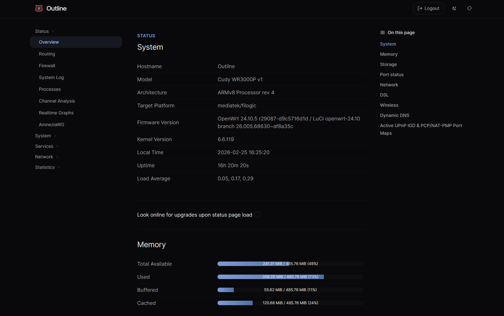
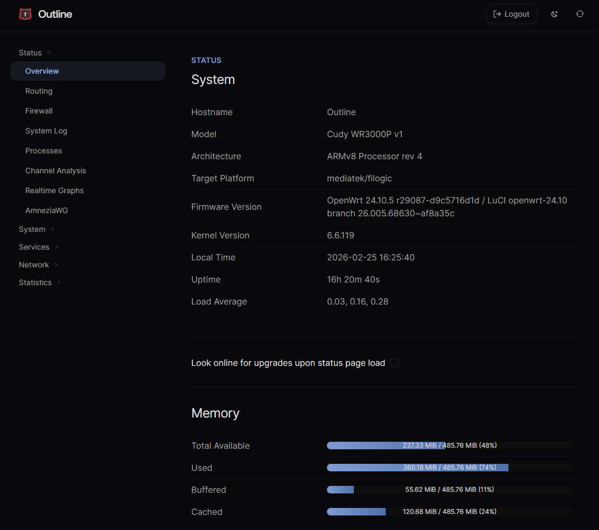
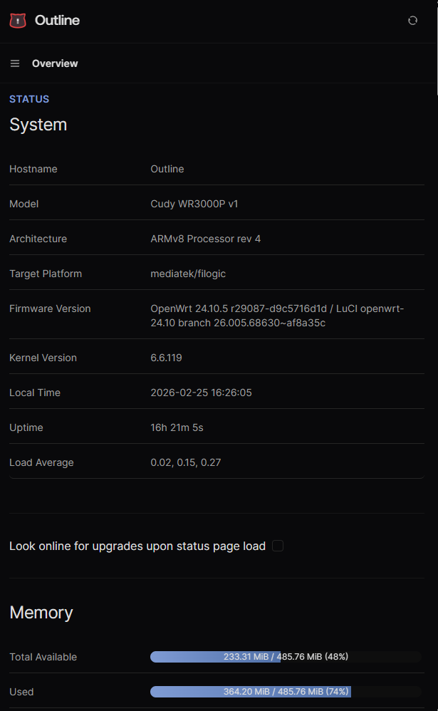

# luci-theme-limcore

A clean, modern dark/light theme for OpenWrt LuCI. Fork of [luci-theme-aurora](https://github.com/eamonxg/luci-theme-aurora) with a complete visual overhaul.

## Preview

| Desktop | Tablet | Phone |
|---------|--------|-------|
|  |  |  |

https://github.com/user-attachments/assets/d3701be2-686f-48ec-b569-c7113755dba5

## Installation

OpenWrt 25.12+ and snapshots use `apk`; earlier versions use `opkg`.

**opkg** (OpenWrt < 25.12):

```sh
cd /tmp && uclient-fetch -O luci-theme-limcore.ipk \
  https://github.com/l-limon-l/luci-theme-limcore/releases/latest/download/luci-theme-limcore_0.12.7-r20260807_all.ipk \
  && opkg install luci-theme-limcore.ipk
```

**apk** (OpenWrt 25.12+):

```sh
cd /tmp && uclient-fetch -O luci-theme-limcore.apk \
  https://github.com/l-limon-l/luci-theme-limcore/releases/latest/download/luci-theme-limcore-0.12.7-r20260807.apk \
  && apk add --allow-untrusted luci-theme-limcore.apk
```

## Compatibility

- **OpenWrt** 23.05+
- **Chrome/Edge** 111+
- **Safari** 16.4+
- **Firefox** 128+

## Features

- Warm neutral palette with proper light/dark mode
- Three-column docs-style layout: sidebar, content, table of contents
- Frosted glass header with scroll-aware opacity
- Floating toast notifications
- Toggle-style boolean checkboxes
- Smooth page transitions via View Transitions API
- Redesigned login page
- Responsive — works on mobile

## Development

Built with **Vite 7**, **Tailwind CSS v4**, and **pnpm**. See [Development docs](.dev/docs/DEVELOPMENT.md).

## License

Apache License 2.0. Based on [luci-theme-aurora](https://github.com/eamonxg/luci-theme-aurora) by eamonxg.
